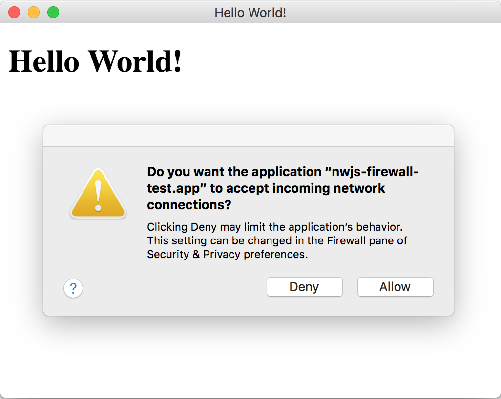

# Run Build with nwbuild

```
git clone https://github.com/wvary/nwjs-firewall-test.git
npm run build
```

I wasn't able to make the build work correct if there is a node_modules directly in this repo. So **don't run** `npm install`.

After the build, you can run the app using this command:
```
open build/nwjs-firewall-test/osx64/nwjs-firewall-test.app
```

You should see the firewall prompt as shown below:


# Run Build with nwjs-builder-phoenix

To test this project using the nwjs-builder-phoenix builder, try the following commands:

```
git checkout try-nwjs-builder-phoenix
npm install
npm run build
```

There should be a folder named `dist` containing this application.
Running the application also shows the firewall prompt.


